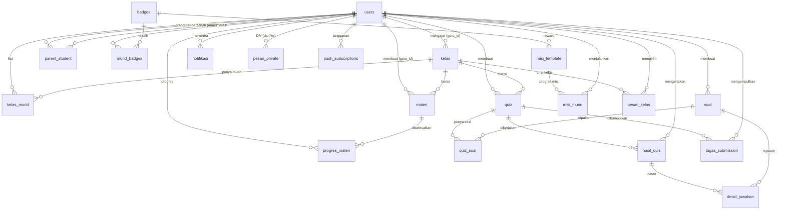

# 1. Pemrograman dan Source Code

Dokumen ini menjelaskan sistem **KitaBelajar** dari sisi pemrograman dan source code, mencakup deskripsi umum sistem serta kebutuhan, komponen, dan teknologi yang digunakan.

---

## A. Deskripsi Umum Sistem

**KitaBelajar** adalah sebuah platform pembelajaran daring (*Learning Management System* / LMS) berbasis web yang dirancang untuk mendukung kegiatan belajar-mengajar antara **guru**, **murid**, dan **orangtua** di Indonesia, khususnya jenjang SD, SMP, dan SMA.

Sistem ini berjalan sepenuhnya melalui **browser** (tanpa perlu instalasi aplikasi) dan dapat diakses dari komputer maupun ponsel. Tujuannya adalah menyediakan ruang belajar yang interaktif, menyenangkan, dan terpusat — menggabungkan materi, latihan, ujian, komunikasi, hingga pemantauan oleh orangtua dalam satu tempat.

### Pengguna Sistem (Aktor)
| Aktor | Peran |
|-------|-------|
| **Guru** | Membuat kelas, mengunggah materi, membuat quiz/PR, menilai tugas, mengadakan video call, dan memantau perkembangan murid. |
| **Murid** | Bergabung ke kelas, mempelajari materi, mengerjakan quiz/latihan, mengikuti kelas online, serta mengumpulkan reward (XP, badge, level). |
| **Orangtua** | Memantau aktivitas dan perkembangan belajar anak (nilai, tugas, materi yang diselesaikan). Akun dibuat otomatis saat murid mendaftar. |

### Fitur Utama
1. **Manajemen Kelas** — guru membuat kelas, murid bergabung menggunakan kode akses.
2. **Materi Belajar** — dalam bentuk teks, PDF, video, atau gambar.
3. **Quiz & Latihan Soal** — quiz kilat, quiz live multiplayer (KitaQuiz), bank soal, serta PR/tugas yang dapat dikumpulkan dan dinilai.
4. **Kelas Online (Video Call)** — pertemuan tatap muka secara daring menggunakan Jitsi.
5. **Komunikasi** — chat kelas dan chat privat (terenkripsi).
6. **Gamifikasi** — sistem XP, level, streak, badge, misi harian/mingguan, hadiah harian, dan leaderboard untuk memotivasi murid.
7. **Asisten AI** — chatbot pintar untuk murid (bantuan belajar) dan guru (membuat soal, RPP, hingga pencarian referensi realtime dari web).
8. **Akun Orangtua** — memantau aktivitas belajar anak.
9. **Notifikasi** — pemberitahuan di dalam aplikasi (*in-app*) maupun *push notification*.
10. **Onboarding Data Diri** — pengisian data diri (alamat, umur, asal sekolah) saat pendaftaran, dilengkapi reward XP bagi murid.

### Cara Kerja Singkat
Pengguna membuka aplikasi di browser → melakukan login/registrasi → sistem memberikan token (JWT) sebagai tanda pengenal → setiap permintaan data (materi, quiz, dll) dikirim ke server melalui **REST API** → server mengambil/menyimpan data di **database** → hasil dikirim balik ke browser. Untuk fitur waktu-nyata (chat, quiz live, video call) digunakan **WebSocket (Socket.io)**.

---

## B. Kebutuhan Umum Sistem, Penjelasan Komponen, dan Teknologi

### B.1 Kebutuhan Umum Sistem

#### a. Kebutuhan Fungsional (apa yang harus bisa dilakukan sistem)
- Pengguna dapat mendaftar dan login (manual dengan verifikasi OTP email, maupun via Google).
- Guru dapat membuat & mengelola kelas, materi, soal, quiz, dan tugas.
- Murid dapat bergabung ke kelas, belajar, mengerjakan quiz/latihan, dan mengumpulkan tugas.
- Sistem dapat menghitung dan menyimpan nilai, XP, level, serta progres murid.
- Sistem dapat mengadakan quiz live dan video call secara waktu-nyata.
- Sistem dapat mengirim notifikasi (in-app & push) dan email (OTP, reset password, kredensial orangtua).
- Orangtua dapat memantau aktivitas anak.
- Asisten AI dapat menjawab pertanyaan dan mencari informasi terbaru dari internet.

#### b. Kebutuhan Non-Fungsional (kualitas sistem)
- **Keamanan**: password di-*hash* (bcrypt), isi chat dienkripsi (AES-256-GCM), autentikasi dengan JWT, pembatasan request (*rate limiting*), filter konten terlarang, dan *security headers* (Helmet/CSP).
- **Ketersediaan**: di-*hosting* di Railway agar dapat diakses kapan saja secara daring.
- **Kinerja**: respons dikompresi (Gzip), aset di-*cache*, dan AI memakai mekanisme *fallback* dua API key.
- **Kompatibilitas**: berbasis web, dapat dibuka di berbagai perangkat dan browser modern.
- **Keandalan**: pencatatan error (*error logging*) untuk memudahkan perbaikan.

#### c. Kebutuhan Perangkat
**Untuk pengembangan / menjalankan server:**
- Node.js (versi LTS) dan npm
- Koneksi internet (untuk mengakses Supabase dan layanan eksternal)
- File konfigurasi `.env` berisi kunci rahasia (Supabase, JWT, Groq, dll)

**Untuk pengguna akhir:**
- Perangkat (HP/laptop/komputer) dengan **browser modern** (Chrome, Firefox, Safari, Edge)
- Koneksi internet
- Kamera & mikrofon (khusus untuk fitur video call)

---

### B.2 Penjelasan Komponen Sistem

Sistem KitaBelajar terdiri atas beberapa komponen utama yang saling terhubung:

```
┌──────────────────────────────────────────────────────┐
│                 FRONTEND (Browser)                     │
│   Antarmuka pengguna (HTML/CSS/JavaScript) + SPA       │
└───────────────┬──────────────────────┬────────────────┘
                │ REST API (HTTP)       │ WebSocket (realtime)
                ▼                       ▼
┌──────────────────────────────────────────────────────┐
│              BACKEND (Server Node.js)                  │
│   Express (REST API) + Socket.io (realtime) +          │
│   Middleware keamanan + Proxy AI                       │
└───────┬───────────────────┬──────────────┬────────────┘
        ▼                   ▼              ▼
   ┌─────────┐       ┌────────────┐   ┌──────────────────┐
   │ DATABASE│       │  AI (Groq) │   │ LAYANAN EKSTERNAL │
   │Supabase │       │            │   │ Email, Video, dll │
   └─────────┘       └────────────┘   └──────────────────┘
```

#### 1. Frontend (Antarmuka Pengguna)
Bagian yang dilihat dan digunakan langsung oleh pengguna di browser. Dibuat dengan **HTML, CSS, dan JavaScript murni** (tanpa framework), berbentuk **Single Page Application (SPA)** — seluruh halaman berada dalam satu file utama (`public/belajar-seru.html`) dan berpindah halaman tanpa *reload*. Bertugas menampilkan tampilan, menerima input, lalu memanggil server melalui API.

#### 2. Backend (Server)
Otak aplikasi yang berjalan di server (`src/server.js`). Tugasnya:
- Menyediakan **REST API** (`/api/...`) untuk semua operasi data.
- Mengelola **komunikasi realtime** (Socket.io) untuk chat, quiz live, dan video call.
- Menerapkan **keamanan** (verifikasi token, pembatasan request, filter konten).
- Menjadi **perantara (proxy)** ke layanan AI agar kunci API tidak bocor ke pengguna.

#### 3. Database
Tempat penyimpanan data permanen menggunakan **Supabase (PostgreSQL)**. Menyimpan data pengguna, kelas, materi, soal, quiz, nilai, notifikasi, pesan, dan data gamifikasi.

#### 4. Layanan Eksternal (API Pihak Ketiga)
Fitur tertentu memanfaatkan layanan luar: AI (Groq), email (Brevo), video call (Jitsi), text-to-speech (HuggingFace), login Google (OAuth), dan pencarian web (SearXNG).

#### 5. Middleware & Utilitas
Komponen pendukung: middleware autentikasi & keamanan, serta utilitas untuk AI, gamifikasi (perhitungan XP/level/misi), dan enkripsi pesan.

---

### B.3 Teknologi yang Digunakan

#### a. Bahasa Pemrograman
| Bahasa | Penggunaan |
|--------|-----------|
| **JavaScript (Node.js)** | Backend / server |
| **JavaScript** | Logika frontend |
| **HTML & CSS** | Struktur & tampilan antarmuka |
| **SQL** | Skema & query database (PostgreSQL) |

#### b. Teknologi Backend
| Teknologi | Fungsi |
|-----------|--------|
| **Node.js + Express.js** | Server HTTP dan REST API |
| **Supabase (PostgreSQL)** | Database utama |
| **Socket.io** | Komunikasi realtime (chat, quiz live, video signaling) |
| **JWT (jsonwebtoken)** | Autentikasi berbasis token |
| **bcryptjs** | Enkripsi (hashing) password |
| **Helmet** | Security headers & Content Security Policy |
| **express-rate-limit** | Pembatasan jumlah request (anti brute-force) |
| **Multer** | Upload file materi |
| **validator & xss** | Validasi dan sanitasi input |
| **compression** | Kompresi (Gzip) respons |
| **AES-256-GCM (crypto)** | Enkripsi isi pesan di database |

#### c. Teknologi Frontend
| Teknologi | Fungsi |
|-----------|--------|
| **HTML5, CSS3, JavaScript (vanilla)** | Antarmuka & logika tampilan (SPA) |
| **Service Worker** | Push notification |
| **KaTeX** | Menampilkan rumus matematika di chat AI |

#### d. Layanan Eksternal
| Layanan | Fungsi |
|---------|--------|
| **Groq AI (LLaMA/Qwen)** | Mesin chatbot AI (chat, soal, ringkasan, analisis gambar) |
| **Brevo** | Pengiriman email (OTP, reset password, kredensial orangtua) |
| **Jitsi** (`meet.ffmuc.net`) | Video call kelas (tanpa API key) |
| **HuggingFace** | Text-to-Speech (suara AI) |
| **Google OAuth** | Login dengan akun Google |
| **SearXNG** | Pencarian web realtime untuk Asisten Guru |
| **YouTube** | Embed video & pengambilan transkrip |

#### e. Tools & Deployment
| Tools | Fungsi |
|-------|--------|
| **Git & GitHub** | Pengelolaan versi source code |
| **Railway** | Hosting (server + frontend) |
| **npm** | Manajemen dependency & script |
| **Visual Studio Code** | Editor kode |

---

---

## C. Desain Database (Database Design)

Sistem menggunakan **Supabase (PostgreSQL)**. Berikut rancangan basis datanya: daftar tabel, relasi antar tabel (ERD), dan struktur kolom tiap tabel.

### C.1 Daftar Tabel (Dikelompokkan per Domain)

| Domain | Tabel |
|--------|-------|
| **Pengguna & Relasi** | `users`, `kelas`, `kelas_murid`, `parent_student` |
| **Materi** | `materi`, `progres_materi` |
| **Soal, Quiz & Tugas** | `soal`, `quiz`, `quiz_soal`, `hasil_quiz`, `detail_jawaban`, `tugas_submission` |
| **Gamifikasi** | `badges`, `murid_badges`, `misi_template`, `misi_murid` |
| **Komunikasi & Notifikasi** | `notifikasi`, `pesan_kelas`, `pesan_private`, `push_subscriptions` |
| **Sistem** | `error_logs` |

### C.2 Diagram Relasi Antar Tabel (ERD)

> Inti relasi: tabel `users` menjadi pusat (satu user bisa berperan guru/murid/orangtua), terhubung ke kelas, materi, quiz, gamifikasi, dan komunikasi.



### C.3 Struktur Tabel

> Keterangan: **PK** = Primary Key, **FK** = Foreign Key, **UQ** = Unique.

#### 👤 `users` — Akun pengguna (guru, murid, orangtua)
| Kolom | Tipe | Keterangan |
|-------|------|-----------|
| id | UUID | **PK** |
| nama | TEXT | Nama lengkap |
| email | TEXT | **UQ**, email login |
| password | TEXT | Hash bcrypt |
| role | TEXT | `guru` / `murid` / `orangtua` |
| avatar | TEXT | Emoji / URL foto |
| kelas | TEXT | Kelas murid (mis. "4A") |
| xp | INT | Poin pengalaman |
| level | INT | Level (xp/1000 + 1) |
| streak | INT | Hari belajar beruntun |
| last_active | DATE | Aktivitas terakhir |
| quiz_count | INT | Jumlah quiz dikerjakan |
| avg_skor | NUMERIC | Rata-rata skor |
| latihan_count | INT | Jumlah sesi latihan |
| belajar_count | INT | Jumlah materi AyoBelajar dibuka |
| alamat | TEXT | Data diri |
| umur | INT | Data diri |
| asal_sekolah | TEXT | Data diri |
| profil_lengkap | BOOL | Penanda data diri lengkap |
| reset_otp / reset_otp_expiry | TEXT / TIMESTAMPTZ | OTP reset password |
| reset_token / reset_token_expiry | TEXT / TIMESTAMPTZ | Token reset password |
| created_at | TIMESTAMPTZ | Waktu daftar |

#### 🏫 `kelas` — Kelas yang dibuat guru
| Kolom | Tipe | Keterangan |
|-------|------|-----------|
| id | UUID | **PK** |
| nama | TEXT | Nama kelas |
| tahun_ajar | TEXT | Tahun ajaran |
| guru_id | UUID | **FK** → users |
| kode_akses | TEXT | **UQ**, kode untuk gabung |
| mapel | TEXT | Mata pelajaran |
| created_at | TIMESTAMPTZ | |

#### 🔗 `kelas_murid` — Relasi murid ↔ kelas (many-to-many)
| Kolom | Tipe | Keterangan |
|-------|------|-----------|
| kelas_id | UUID | **PK**, **FK** → kelas |
| murid_id | UUID | **PK**, **FK** → users |
| joined_at | TIMESTAMPTZ | |

#### 👨‍👩‍👧 `parent_student` — Relasi orangtua ↔ murid
| Kolom | Tipe | Keterangan |
|-------|------|-----------|
| id | UUID | **PK** |
| parent_id | UUID | **FK** → users (orangtua) |
| murid_id | UUID | **FK** → users (murid) |
| created_at | TIMESTAMPTZ | **UQ**(parent_id, murid_id) |

#### 📚 `materi` — Materi pembelajaran
| Kolom | Tipe | Keterangan |
|-------|------|-----------|
| id | UUID | **PK** |
| judul / deskripsi | TEXT | |
| mapel | TEXT | Mata pelajaran |
| jenis | TEXT | `pdf` / `video` / `teks` / `gambar` |
| konten | TEXT | Isi teks |
| file_url | TEXT | URL file (Supabase Storage) |
| guru_id | UUID | **FK** → users |
| kelas_id | UUID | **FK** → kelas |
| status | TEXT | `aktif` / `draft` |
| views | INT | Jumlah dilihat |
| created_at | TIMESTAMPTZ | |

#### ✅ `progres_materi` — Materi yang diselesaikan murid
| Kolom | Tipe | Keterangan |
|-------|------|-----------|
| murid_id | UUID | **PK**, **FK** → users |
| materi_id | UUID | **PK**, **FK** → materi |
| selesai | BOOL | |
| updated_at | TIMESTAMPTZ | |

#### ❓ `soal` — Bank soal
| Kolom | Tipe | Keterangan |
|-------|------|-----------|
| id | UUID | **PK** |
| pertanyaan | TEXT | |
| emoji | TEXT | |
| mapel | TEXT | |
| jenis | TEXT | `pilihan_ganda` / `isian` / `benar_salah` |
| opsi | JSONB | Array pilihan jawaban |
| jawaban | TEXT | Jawaban benar |
| poin | INT | |
| tingkat | TEXT | `mudah` / `sedang` / `sulit` |
| guru_id | UUID | **FK** → users |
| created_at | TIMESTAMPTZ | |

#### 📝 `quiz` — Quiz / PR / Tugas
| Kolom | Tipe | Keterangan |
|-------|------|-----------|
| id | UUID | **PK** |
| judul / deskripsi | TEXT | |
| mapel | TEXT | |
| guru_id | UUID | **FK** → users |
| kelas_id | UUID | **FK** → kelas |
| durasi | INT | Menit |
| status | TEXT | `aktif` / `nonaktif` |
| tipe | TEXT | `fun` / `pr` |
| deadline | TIMESTAMPTZ | Batas waktu PR |
| tipe_submission | TEXT | `file`/`link`/`gambar`/`teks`/`semua`/NULL |
| created_at | TIMESTAMPTZ | |

#### 🔗 `quiz_soal` — Relasi quiz ↔ soal
| Kolom | Tipe | Keterangan |
|-------|------|-----------|
| quiz_id | UUID | **PK**, **FK** → quiz |
| soal_id | UUID | **PK**, **FK** → soal |
| urutan | INT | Urutan soal |

#### 🎯 `hasil_quiz` — Hasil pengerjaan quiz
| Kolom | Tipe | Keterangan |
|-------|------|-----------|
| id | UUID | **PK** |
| murid_id | UUID | **FK** → users |
| quiz_id | UUID | **FK** → quiz |
| skor / benar / total_soal | INT | Hasil |
| durasi_detik | INT | Lama pengerjaan |
| selesai_at | TIMESTAMPTZ | |

#### 🧾 `detail_jawaban` — Rincian jawaban per soal
| Kolom | Tipe | Keterangan |
|-------|------|-----------|
| id | UUID | **PK** |
| hasil_id | UUID | **FK** → hasil_quiz |
| soal_id | UUID | **FK** → soal |
| jawaban_user | TEXT | Jawaban murid |
| benar | BOOL | |
| poin_dapat | INT | |

#### 📤 `tugas_submission` — Pengumpulan tugas/PR
| Kolom | Tipe | Keterangan |
|-------|------|-----------|
| id | UUID | **PK** |
| quiz_id | UUID | **FK** → quiz |
| murid_id | UUID | **FK** → users |
| tipe | TEXT | `file`/`link`/`gambar`/`teks` |
| konten | TEXT | Teks / URL link |
| file_url / file_nama / file_size | TEXT/TEXT/INT | Berkas |
| catatan | TEXT | Catatan murid |
| submitted_at | TIMESTAMPTZ | |
| nilai | INT | Nilai dari guru |
| feedback | TEXT | Umpan balik guru |
| dinilai_at | TIMESTAMPTZ | **UQ**(quiz_id, murid_id) |

#### 🏅 `badges` — Definisi lencana
| Kolom | Tipe | Keterangan |
|-------|------|-----------|
| id | UUID | **PK** |
| nama / deskripsi / icon | TEXT | |
| tipe | TEXT | `misi`/`streak`/`level`/`akurasi`/`spesial` |
| created_at | TIMESTAMPTZ | |

#### 🎖️ `murid_badges` — Lencana yang diraih murid
| Kolom | Tipe | Keterangan |
|-------|------|-----------|
| id | UUID | **PK** |
| murid_id | UUID | **FK** → users |
| badge_id | UUID | **FK** → badges |
| diperoleh_at | TIMESTAMPTZ | **UQ**(murid_id, badge_id) |

#### 🎯 `misi_template` — Definisi misi
| Kolom | Tipe | Keterangan |
|-------|------|-----------|
| id | UUID | **PK** |
| judul / deskripsi / icon | TEXT | |
| tipe | TEXT | `harian`/`mingguan`/`achievement` |
| kondisi_tipe | TEXT | `quiz_count`/`xp_gained`/`streak`/`akurasi`/`materi_count`/`latihan_count`/`belajar_count`/`level` |
| kondisi_target | INT | Target penyelesaian |
| reward_xp | INT | XP hadiah |
| reward_badge_id | UUID | **FK** → badges |
| urutan / aktif | INT / BOOL | |
| created_at | TIMESTAMPTZ | |

#### 📈 `misi_murid` — Progres misi per murid
| Kolom | Tipe | Keterangan |
|-------|------|-----------|
| id | UUID | **PK** |
| murid_id | UUID | **FK** → users |
| misi_id | UUID | **FK** → misi_template |
| progres / target | INT | |
| selesai / reward_claimed | BOOL | |
| periode | DATE | Tanggal (harian/mingguan) atau NULL (achievement) |
| selesai_at / created_at | TIMESTAMPTZ | **UQ**(murid_id, misi_id, periode) |

#### 🔔 `notifikasi` — Notifikasi in-app
| Kolom | Tipe | Keterangan |
|-------|------|-----------|
| id | UUID | **PK** |
| user_id | UUID | **FK** → users |
| judul / pesan | TEXT | |
| dibaca | BOOL | |
| tipe | TEXT | `info`/`quiz`/`reward`/`orangtua`, dll |
| data_extra | TEXT | Data tambahan (JSON string) |
| created_at | TIMESTAMPTZ | |

#### 💬 `pesan_kelas` — Chat kelas
| Kolom | Tipe | Keterangan |
|-------|------|-----------|
| id | UUID | **PK** |
| kelas_id | UUID | **FK** → kelas |
| pengirim_id | UUID | **FK** → users |
| isi | TEXT | (terenkripsi AES) |
| created_at | TIMESTAMPTZ | |

#### ✉️ `pesan_private` — Chat privat (DM)
| Kolom | Tipe | Keterangan |
|-------|------|-----------|
| id | UUID | **PK** |
| dari_id | UUID | **FK** → users (pengirim) |
| ke_id | UUID | **FK** → users (penerima) |
| isi | TEXT | (terenkripsi AES) |
| dibaca / edited | BOOL | |
| created_at | TIMESTAMPTZ | |

#### 📲 `push_subscriptions` — Langganan push notification
| Kolom | Tipe | Keterangan |
|-------|------|-----------|
| id | UUID | **PK** |
| user_id | UUID | **FK** → users |
| endpoint | TEXT | Endpoint browser |
| p256dh / auth | TEXT | Kunci enkripsi push |
| created_at | TIMESTAMPTZ | **UQ**(user_id, endpoint) |

#### 🐞 `error_logs` — Log error (dibuat manual di Supabase)
| Kolom | Tipe | Keterangan |
|-------|------|-----------|
| id | UUID | **PK** |
| sumber | TEXT | `frontend` / `backend` |
| pesan / stack / url / method | TEXT | Detail error |
| user_id | UUID | Pengguna terkait (opsional) |
| user_agent / extra | TEXT | Info tambahan |
| created_at | TIMESTAMPTZ | |

### C.4 Ringkasan Relasi Penting
- **users → kelas**: satu guru punya banyak kelas (1:N via `guru_id`).
- **kelas ↔ users (murid)**: banyak-ke-banyak lewat **`kelas_murid`**.
- **users ↔ users**: relasi orangtua-anak lewat **`parent_student`**.
- **quiz ↔ soal**: banyak-ke-banyak lewat **`quiz_soal`**.
- **hasil_quiz → detail_jawaban**: satu hasil punya banyak rincian jawaban (1:N).
- **users ↔ badges**: banyak-ke-banyak lewat **`murid_badges`**.
- Hampir semua FK memakai **`ON DELETE CASCADE`** (data anak ikut terhapus jika induk dihapus).

---

## D. Panduan Penggunaan (User Manual)

Bagian ini menjelaskan cara memakai aplikasi **KitaBelajar** langkah demi langkah untuk setiap jenis pengguna. Aplikasi dibuka melalui **browser** (tidak perlu instalasi).

### D.1 Memulai (Semua Pengguna)

#### a. Membuka Aplikasi
Buka alamat aplikasi di browser (mis. `https://kitabelajar.up.railway.app`). Halaman awal (*landing*) menampilkan tombol **Masuk** dan **Daftar**.

#### b. Mendaftar Akun Baru
Tersedia dua cara:

**Cara 1 — Daftar manual (email + OTP):**
1. Klik **Daftar**.
2. Pilih peran: **Guru** atau **Murid**.
3. Isi nama, email, dan password.
4. Jika mendaftar sebagai **Guru**, lengkapi juga data diri (alamat, umur, asal sekolah) di formulir.
5. Klik daftar — kode **OTP** akan dikirim ke email.
6. Masukkan kode OTP untuk menyelesaikan pendaftaran.

**Cara 2 — Daftar dengan Google:**
1. Klik **Masuk dengan Google**.
2. Pilih akun Google.
3. Jika akun baru, pilih peran (**Guru**/**Murid**). Akun langsung jadi tanpa OTP.

> **Catatan untuk Murid:** Setelah mendaftar, muncul *popup* pengisian **data diri** (alamat, umur, asal sekolah). Mengisinya memberi hadiah **+150 XP**. Boleh dilewati, tapi pengingat akan muncul lagi saat login berikutnya hingga terisi.
>
> **Akun Orangtua otomatis:** Saat seorang murid mendaftar, sistem otomatis membuat **akun orangtua**. Email & password akun orangtua dikirim ke email murid dan juga tersimpan sebagai **notifikasi** di dalam aplikasi.

#### c. Masuk (Login)
1. Klik **Masuk**.
2. Masukkan email & password (atau gunakan **Masuk dengan Google**).
3. Sistem mengarahkan ke dashboard sesuai peran.

#### d. Lupa Password
1. Di halaman login, klik **Lupa Password**.
2. Masukkan email → kode **OTP** dikirim ke email.
3. Masukkan OTP, lalu buat password baru.

---

### D.2 Panduan untuk **Murid**

Setelah login, murid masuk ke **Dashboard Murid** yang menampilkan XP, level, streak, dan menu utama.

| Aktivitas | Cara melakukannya |
|-----------|-------------------|
| **Gabung kelas** | Klik **Gabung Kelas** → masukkan **kode akses** yang diberikan guru. |
| **Belajar materi** | Buka kelas → pilih materi (teks/PDF/video/gambar). Materi yang selesai dibaca menambah progres. |
| **Mengerjakan Quiz / PR** | Buka quiz aktif → jawab soal sebelum waktu/deadline habis → kirim. Skor & XP langsung dihitung. |
| **Mengumpulkan tugas** | Pada PR bertipe tugas, unggah berkas / tautan / teks / gambar sesuai yang diminta guru. |
| **KitaQuiz (quiz live)** | Masukkan **kode room** quiz live dari guru → jawab soal secara waktu-nyata bersama teman → lihat peringkat langsung. |
| **Latihan soal** | Pilih menu latihan untuk berlatih soal mandiri. |
| **Kelas online (video call)** | Klik tautan/menu video call kelas saat guru mengadakan pertemuan. Izinkan akses kamera & mikrofon. |
| **Chat** | Gunakan **chat kelas** untuk diskusi grup, atau **chat privat** untuk pesan langsung. |
| **Asisten AI** | Buka chatbot AI untuk bertanya pelajaran, minta penjelasan, atau bantuan mengerjakan soal. |
| **Misi & Hadiah** | Selesaikan **misi harian/mingguan** untuk XP & badge. Ambil **hadiah harian** setiap hari. |
| **Leaderboard** | Lihat peringkat XP untuk memacu semangat belajar. |

> **Sistem Gamifikasi:** Setiap aktivitas (mengerjakan quiz, membaca materi, login harian) memberi **XP**. Setiap **1000 XP = naik 1 level**. Login beruntun menambah **streak**. Pencapaian tertentu memberi **badge**.

---

### D.3 Panduan untuk **Guru**

Setelah login, guru masuk ke **Dashboard Guru** untuk mengelola pembelajaran.

| Aktivitas | Cara melakukannya |
|-----------|-------------------|
| **Membuat mata pelajaran** | Buat mata pelajaran terlebih dahulu sebelum membuat kelas. |
| **Membuat kelas** | Klik **Buat Kelas** → isi nama, tahun ajar, mapel. Sistem membuat **kode akses** untuk dibagikan ke murid. |
| **Mengunggah materi** | Buka kelas → **Tambah Materi** → pilih jenis (teks/PDF/video/gambar) → unggah/isi konten. |
| **Membuat bank soal** | Buka menu soal → buat soal (pilihan ganda/isian/benar-salah) lengkap dengan jawaban & poin. |
| **Membuat Quiz / PR** | Klik **Buat Quiz** → pilih soal dari bank soal → atur durasi, tipe (fun/PR), deadline, dan tipe pengumpulan. |
| **Menilai tugas** | Buka daftar pengumpulan murid → beri **nilai** & **feedback**. |
| **Melihat daftar murid & nilai** | Buka kelas untuk melihat daftar murid dan rekap penilaian. |
| **Mengadakan kelas online** | Mulai **video call** (Jitsi) untuk pertemuan tatap muka daring. |
| **KitaQuiz live** | Buat room quiz live → bagikan **kode room** → pantau jalannya quiz secara waktu-nyata. |
| **Asisten AI Guru** | Gunakan AI untuk membuat soal, RPP, ringkasan, hingga **pencarian referensi terbaru dari web** (gunakan kata kunci seperti "terbaru", "berita", "harga"). |
| **Komunikasi** | Balas **chat kelas** dan **chat privat** dari murid. |

---

### D.4 Panduan untuk **Orangtua**

Akun orangtua dibuat **otomatis** saat anak (murid) mendaftar. Kredensial login dikirim via email & notifikasi in-app pada akun murid.

1. **Login** memakai email & password orangtua yang diterima.
2. Masuk ke **Dashboard Orangtua** untuk memantau:
   - Perkembangan belajar anak (XP, level).
   - Nilai quiz & tugas.
   - Materi yang sudah diselesaikan.
3. Menerima **notifikasi** terkait aktivitas anak.

---

### D.5 Pengaturan Akun (Semua Pengguna)

Buka menu **Profil / Pengaturan**:

| Pengaturan | Keterangan |
|------------|-----------|
| **Ubah profil** | Mengubah nama, avatar, dan data diri (alamat, umur, asal sekolah). |
| **Ganti password** | Masukkan password lama lalu password baru. |
| **Notifikasi** | Mengaktifkan *push notification* di browser (bila didukung). |
| **🗑️ Hapus Akun** | Pada menu **Pengaturan**, bagian paling bawah. Untuk menghapus akun: klik **Hapus Akun Saya** → muncul *popup* konfirmasi → **ketik persis frasa `HAPUS AKUN`** untuk mengaktifkan tombol hapus → klik **Hapus Akun Permanen**. |

> ⚠️ **Penghapusan akun bersifat permanen** dan tidak bisa dibatalkan. Seluruh data (kelas, materi, nilai, pesan, dll.) akan ikut terhapus. Jika seorang **murid** menghapus akunnya, akun **orangtua** yang otomatis dibuat untuknya juga ikut terhapus (selama orangtua tersebut tidak terhubung ke murid lain).

---

### D.6 Tips & Pemecahan Masalah

| Masalah | Solusi |
|---------|--------|
| Tidak menerima email OTP | Periksa folder **Spam/Promosi**. Tunggu beberapa menit, lalu coba kirim ulang. |
| Tidak bisa gabung kelas | Pastikan **kode akses** benar (huruf besar/kecil) dan kelas masih aktif. |
| Kamera/mikrofon tidak jalan saat video call | Izinkan akses kamera & mikrofon pada browser; gunakan browser modern (Chrome/Edge/Firefox). |
| Sesi tiba-tiba keluar | Token login kedaluwarsa — cukup login ulang. |
| Halaman tidak memuat / koneksi gagal | Periksa koneksi internet, lalu muat ulang halaman. |

---

*Catatan: Untuk penjelasan teknis yang lebih rinci (daftar lengkap endpoint API, event Socket.io, dan alur tiap fitur), lihat dokumen `ARSITEKTUR.md` di root proyek. Struktur SQL asli ada di `schema.sql` dan file `migration_*.sql`. Untuk panduan pengujian otomatis, lihat `dokumentasi/unit-testing.md`.*
